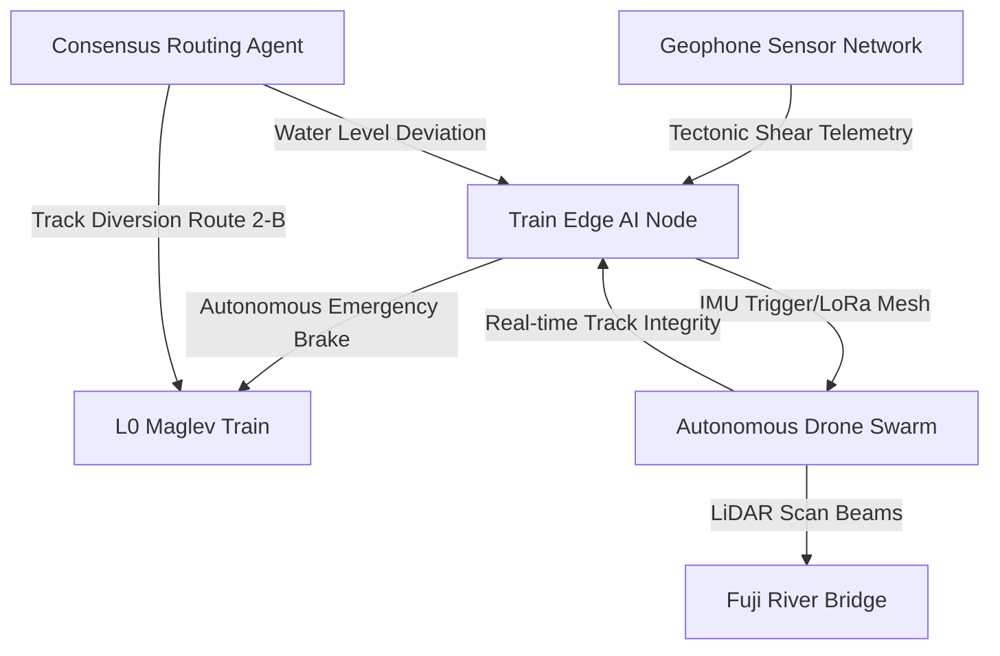

# 🚅 Shinkansen AI Swarm: Autonomous Disaster-Resilient Railway System

An autonomous, disaster-resilient maglev railway and aerial drone swarm system designed to guarantee passenger survival during massive geological events (seismic activity, track flooding). Developed by **Rudra Team** for the **FAR AWAY 2026 Hackathon**, inspired by Japan's Shinkansen safety paradigm.

---

## 📖 Project Overview

Modern high-speed rail systems are vulnerable to earthquakes and sudden flooding. **Shinkansen AI Swarm** solves this vulnerability by merging edge-computing maglev trains, multi-agent AI consensus, and autonomous drone swarms communicating over a private LoRa mesh network. 

This repository implements the **3D Cognitive Digital Twin Simulation Corridor** (Fuji-Shizuoka Maglev Section), showing real-time threat detection, automated braking protocols, bypass rerouting, and drone reconnaissance.

---

## 🏗️ System Architecture



1. **Decoupled Autonomous Edge Nodes**  
   Each train cabin runs localized neural processing nodes that analyze accelerometers and geophones along the bogie. In the event of tectonic shear, it engages the emergency brakes within microseconds—completely independent of cloud infrastructure.

2. **Drone Swarm Reconnaissance Network**  
   Upon emergency triggers, a payload bay opens to launch a swarm of heavy-lift quadcopters. The drones fly ahead of the stopped train to project solid-state LiDAR beams, scanning bridges and tunnels for structural deformities.

3. **LoRa Multi-Hop Mesh Network**  
   Operating on a private 868MHz mesh, the drones, trains, and sidetracks synchronize telemetry over a multi-hop mesh network up to 25 km, ensuring communications remain active even in a total electrical grid collapse.

4. **Hardware Prototype (KiCad)**  
   A routed hardware schematic integrating STM32H7 processing nodes and RF mesh transmitters has been drafted and simulated, acting as the brain for the real-world drone payload bays.

---

## 🛠️ Tech Stack & Features

* **Framework:** Next.js 14 (App Router) & React 18
* **3D Visualizer:** Three.js / React Three Fiber (`@react-three/fiber`) / Drei (`@react-three/drei`)
* **Styling & Theme:** Tailwind CSS (Retro-futuristic / Sci-Fi HUD console styling)
* **Animations:** Framer Motion (Smooth layout changes & indicators)
* **Audio Synthesis:** Web Audio API (Synthesizing real-time warning alarms, clicks, and drone take-offs purely with code oscillators—no heavy external audio files)
* **Vector Graphics:** Lucide React

---

## ⚡ Performance Optimizations

To ensure this interactive dashboard runs at a solid **60+ FPS** without lag on all devices (including mobile browsers and low-spec machines):
* **Ref-Based Animation Loops:** Position coordination between the moving train and tracking drone swarms is done directly through 3D references (`React.RefObject`). We bypassed React state setters inside the Three.js `useFrame` hook, avoiding constant Virtual DOM diffing of the 200+ track segments.
* **Dynamically Imported WebGL Canvas:** The Three.js canvas is dynamically imported with Server-Side Rendering (SSR) disabled, preventing hydration mismatches and optimizing initial page load sizes.
* **Custom Scroll Controls:** Overrode browser-level scrolling indicators to isolate console stream movements within the dashboard log terminal.

---

## 🚀 Getting Started

### 📋 Prerequisites
Make sure you have [Node.js](https://nodejs.org/) (v18+) installed.

### 💻 Local Setup
1. Clone the repository:
   ```bash
   git clone https://github.com/Simarjot846/Shinkansen-Swarm.git
   cd Shinkansen-Swarm
   ```
2. Install dependencies:
   ```bash
   npm install
   ```
3. Run the development server:
   ```bash
   npm run dev
   ```
4. Open [http://localhost:3000](http://localhost:3000) in your browser.

### 🏗️ Build & Lint
To create a production-optimized build and run linter checks:
```bash
npm run build
npm run lint
```

---

## ☁️ Deployment

This project is configured for seamless deployment on the **Vercel Platform**:

1. Push your latest code to your GitHub repository.
2. Go to the [Vercel Dashboard](https://vercel.com/new).
3. Import the repository and select **Next.js** as the framework template.
4. Click **Deploy**. Vercel will automatically compile the production bundle and serve it on a secure edge domain.
